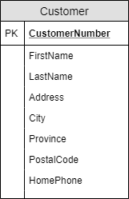
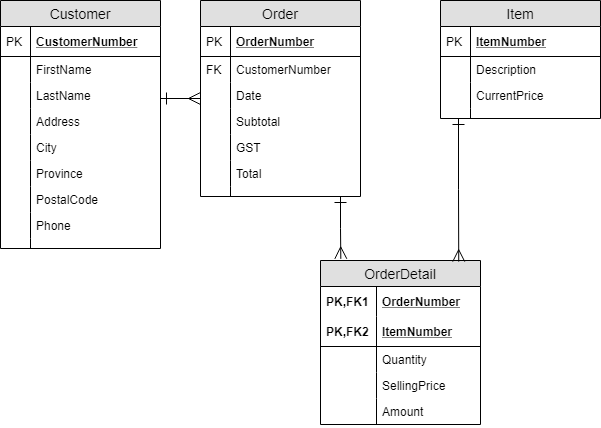

# Lab Template

## Customer Details View

### 0NF

**Customer:** <b class="pk">CustomerNumber</b>, FirstName, LastName, Address, City, Province, PostalCode, HomePhone

### 1NF-3NF

*No changes to the entity/table in 1NF to 3NF.*

### ERD

## Customer Orders View

### 0NF

**Order:** <b class="pk">OrderNumber</b>, CustomerNumber, FirstName, LastName, Address, City, Province, PostalCode, Phone, Date, <b class="rg">ItemNumber, Description, Quantity, CurrentPrice, SellingPrice, Amount</b>, Subtotal, GST, Total

### 1NF

**Order:** <b class="pk">OrderNumber</b>, CustomerNumber, FirstName, LastName, Address, City, Province, PostalCode, Phone, Date, Subtotal, GST, Total

**OrderDetail:** <b class="pk"><u class="fk">OrderNumber</u>, ItemNumber</b>, Description, Quantity, CurrentPrice, SellingPrice, Amount

### 2NF

**OrderDetail:** <b class="pk"><u class="fk">OrderNumber</u>, <u class="fk">ItemNumber</u></b>, Quantity, SellingPrice, Amount

**Item:** <b class="pk">ItemNumber</b>, Description, CurrentPrice

### 3NF

**Order** <b class="pk">OrderNumber</b>, <u class="fk">CustomerNumber</u>, Date, Subtotal, GST, Total

**Customer** <b class="pk">CustomerNumber</b>, FirstName, LastName, Address, City, Province, PostalCode, Phone

### ERD

----

> Your lab is to be submitted as a **Markdown** (`*.md`) file using the following legend. The recommended text editor for these files is [**Visual Studio Code**](https://code.visualstudio.com), as this editor allows you to preview your markdown document as HTML. ERDs can be created using [**Lucidchart**](https://www.lucidchart.com/) and exported as `*.png` files. Check with your instructor about getting a free *Lucidchart* account to use during this course.

## Legend

This legend is a guide to reading and interpreting the table listings under 0NF through 3NF.

- **TableName:** - Table names will be bolded and end with a colon. (e.g.: `**TableName:**`)
- (Column, Names) - Column names for a table will be enclosed in (rounded parenthesis).
- <b class="pk">PrimaryKeyFields</b> - Primary key fields will be bold and inside a box. (e.g: `<b class="pk">PrimaryKeyFields</b>`)
- <u class="fk">ForeignKeyFields</u> - Foreign key fields will be a wavy underline in italic and green. (e.g.: `<u class="fk">ForeignKeyFields</u>`)
- <b class="rg">{</b>Repeating Groups<b class="rg">}</b> - Groups of repeating fields will be identified in 0NF stage, and will be enclosed in orange curly braces. (e.g.: `<b class="rg">{</b>Repeating, Group, Fields<b class="rg">}</b>`)

----

