# git Branches

- [ ] About git branches
- [x] Tutorial

## Tutorial

A good way to learn about branching and using the **git flow** technique is to run through the visual tool at [git-school.github.io/visualizing-git](http://git-school.github.io/visualizing-git/#free). In this walkthrough, we're going to use the following git commands to see what is happening with the git repository.

- **`git commit -m 'commit message'`** - Save your changes to your git history.
- **`git branch -a`** - List **a**ll the branches in your repository.
- **`git branch -d new-branch`** - Delete the branch called "new-branch".
- **`git branch new-branch`** - Create a new branch from the current *`head`* called "new-branch".
- **`git checkout -b new-branch`** - Create a new branch from the current *`head`* called "new-branch" and switch to that branch.
- **`git checkout new-branch`** - Switch from your current branch to the branch named "new-branch".
- **`git merge new-branch`** - Merge the contents of "new-branch" to the branch you are currently on.

| Command | Result |
|:--------|:-------|
| List the current branches `git branch -a` | 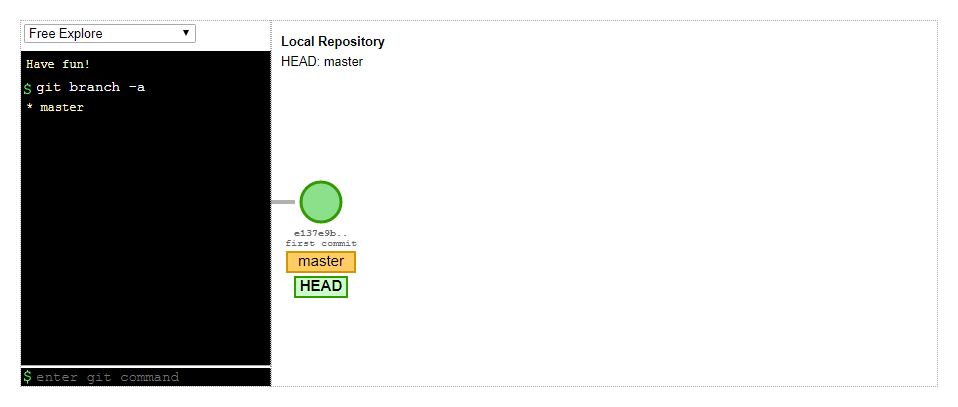 |
| Update the README file `git commit -m "Update README"` | 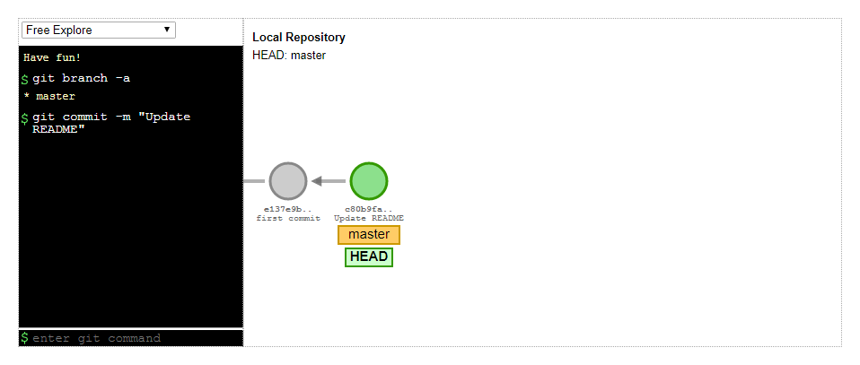 |
| Create a branch called **v1-0** `git branch v1-0` | 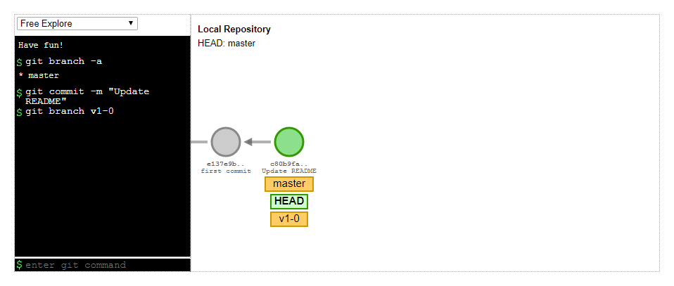 |
| Switch to branch **v1-0** `git checkout v1-0` | 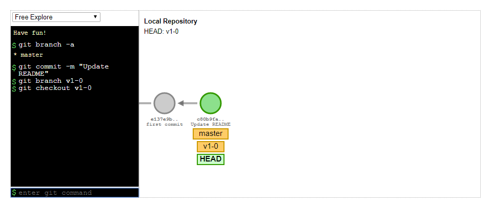 |
| Commit on the **v1-0** branch `git commit -m "Plan feature list"` | 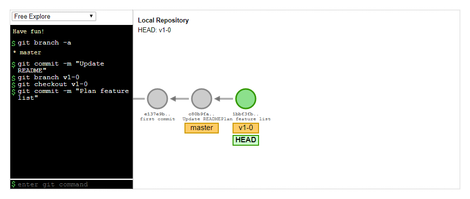 |
| Switch back to the master branch `git checkout master` | 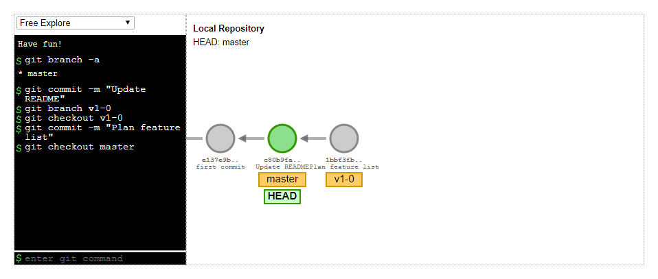 |
| Make a commit on the master branch `git commit -m "Create roadmap for versions 1 and 2"` | 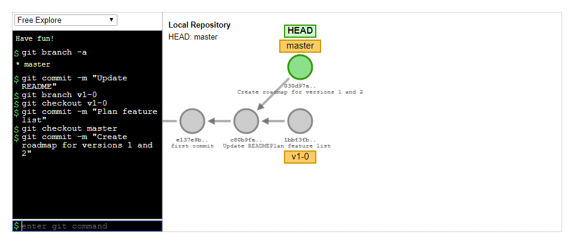 |
| Switch back to the **v1-0** branch `git checkout v1-0` | 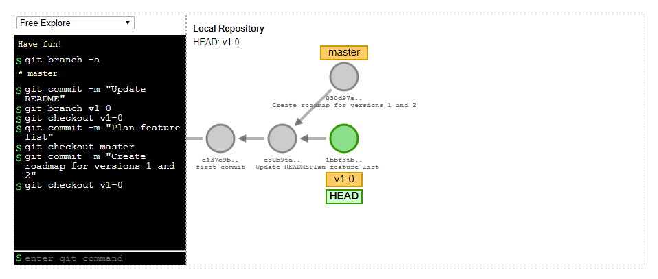 |
| Create a feature branch called **feature-A** based on the current branch and switch to this new branch `git checkout -b feature-A` | 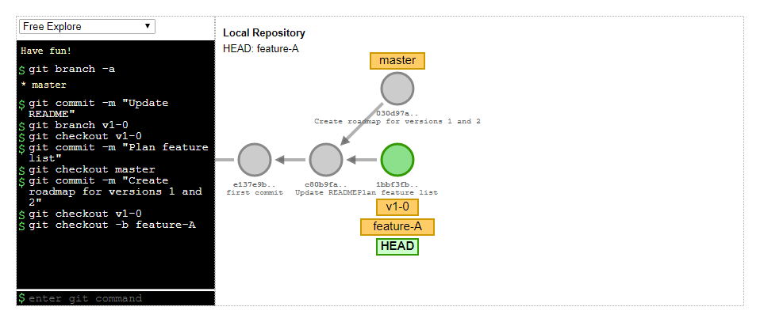 |
| Make a commit `git commit -m "plan feature"` | 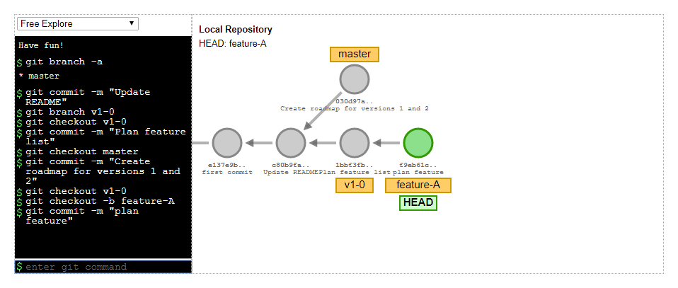 |
| Make another commit `git commit -m "start feature"` | 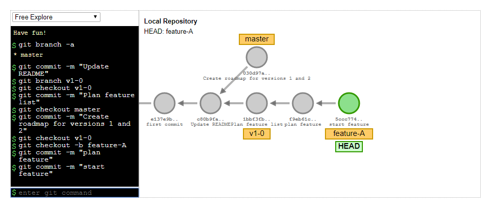 |
| Switch to the **v1-0** branch `git checkout v1-0` | 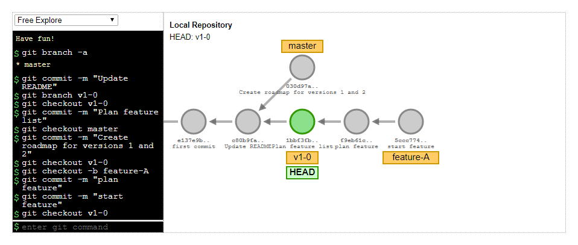 |
| Make a commit `git commit -m "update feature list"` | 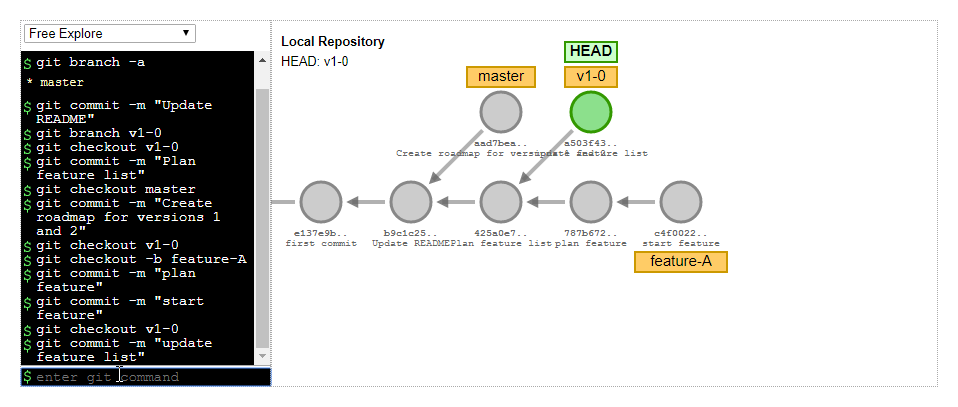 |
| Switch to the **feature-A** branch `git checkout feature-A` | 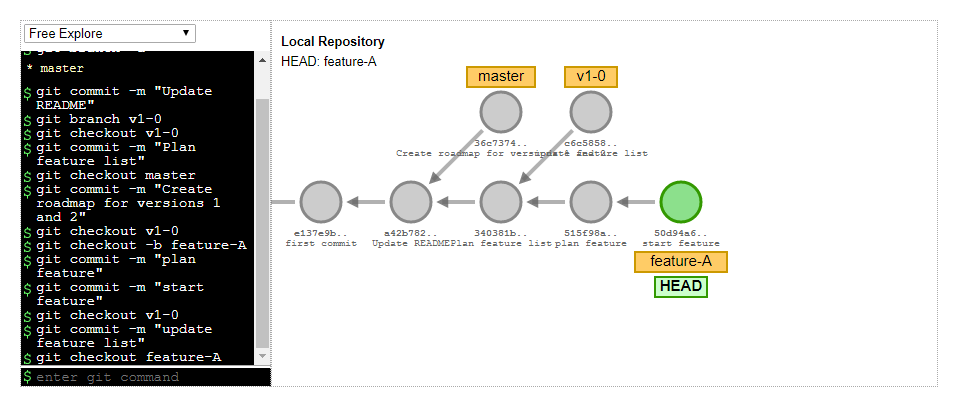 |
| Make a final commit on this branch `git commit -m "finish feature"` | 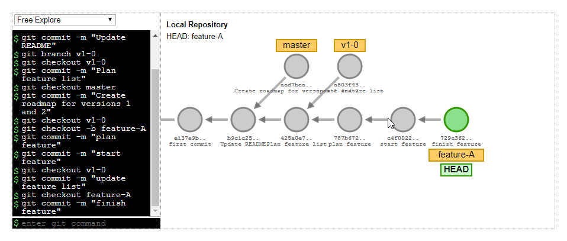 |
| Switch to the **v1-0** branch `git checkout v1-0` |  |
| Merge in the changes from the **feature-A** branch into the **v1-0** branch `git merge feature-A` | 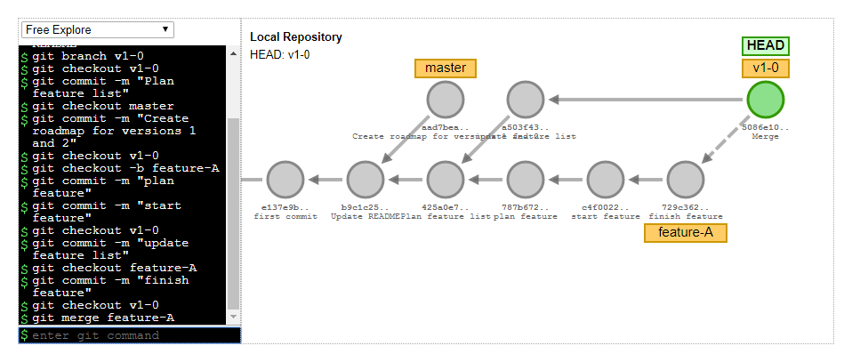 |
| Make a commit `git commit -m "update roadmap"` | 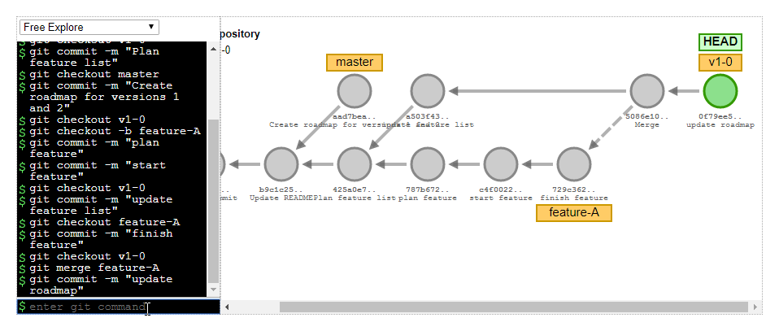 |
| Swith to the **master** branch `git checkout master` | 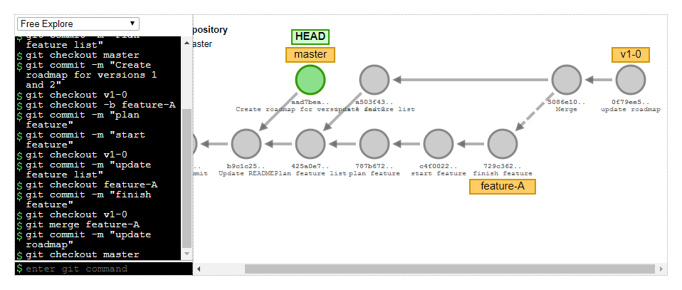 |
| Merge the **v1-0** changes into the **master** branch `git merge v1-0` | 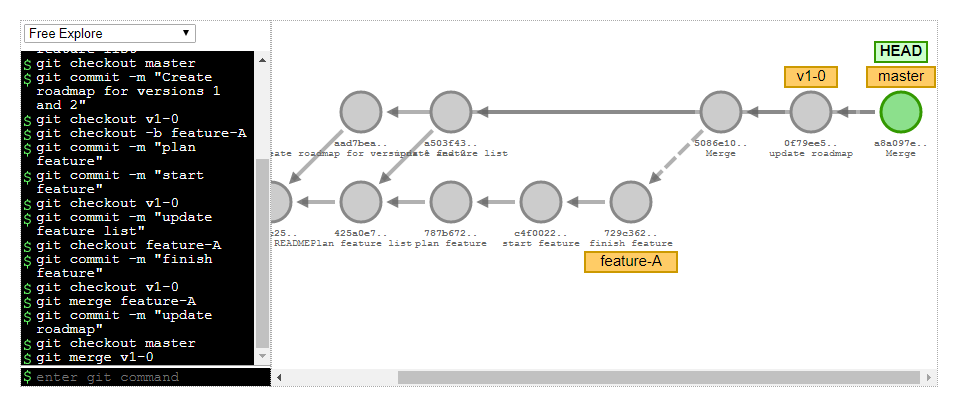 |
| Add a tag to the current commit `git tag v1.0` | 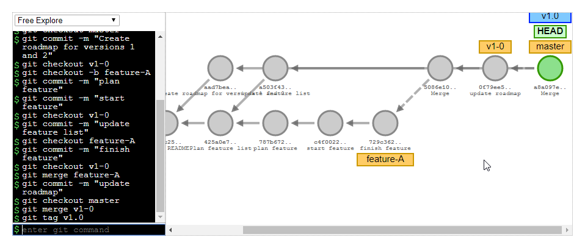 |
| Delete the feature branch `git branch -d feature-A` | 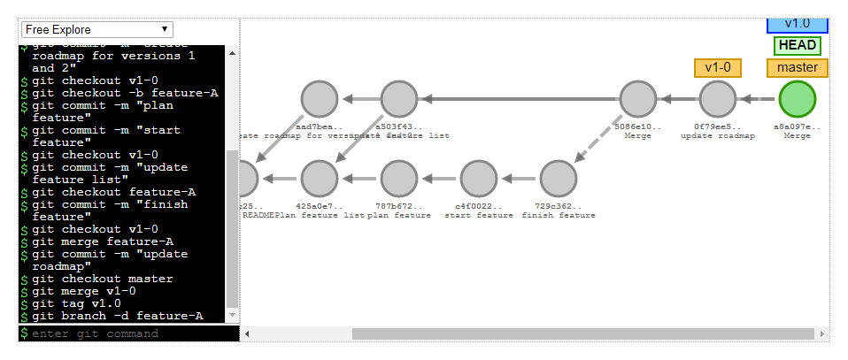 |
| Switch to the **v1-0** branch `git checkout v1-0` | 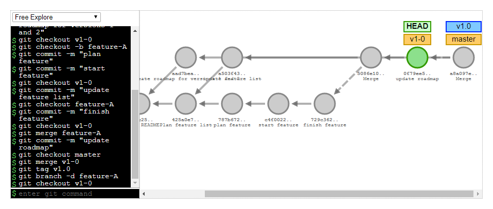 |
| Add a commit about a bug report `git commit -m "bug report"` | 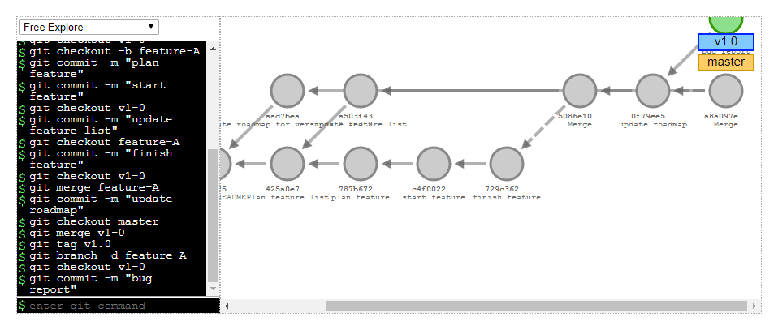 |
| List the branches `git branch -a` | 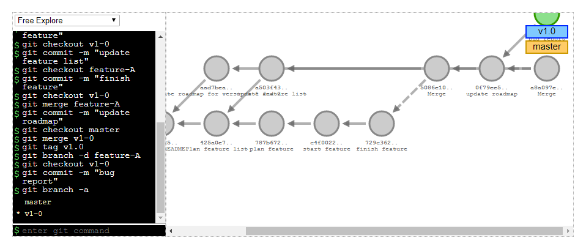 |
