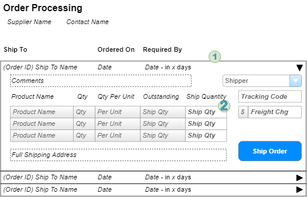

# Order Processing - Implementation Plan

> Orders are shipped directly from our suppliers to our customers. As such, suppliers log onto our system to see what orders there are for the products they provide.

## User Interface

Suppliers will be interacting with a page that shows the following information.

## Implementation

The form will primarily use a `<asp:ListView>` to represent the orders **(1)** and show the order items **(2)** in a `<asp:GridView>` inside of the ListView's `<SelectedItemTemplate>`. The controls I will use include:

1. ListView - for the orders
2. GridView - for the products on the order
3. DropDownList - for the Shipper

Remaining items are simple textboxes/labels/buttons.

### Queries/Presentation

### Commands/Processing

